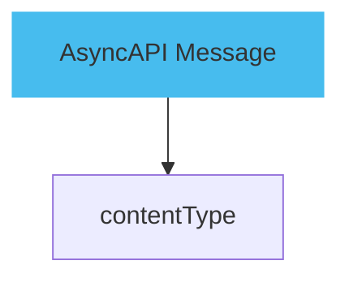

# AsyncAPI

This tutorial will guide you through the process of creating an AsyncAPI document, a powerful tool for defining and managing your asynchronous APIs. AsyncAPI is a specification for APIs that use asynchronous messaging, such as MQTT, AMQP, Kafka, and others. By the end of this tutorial, you should have a basic understanding of how to write an AsyncAPI document.



## Step 1 - Setting up your environment

Before starting, make sure you have Node.js and npm installed on your machine. If not, you can download and install them from [here](https://nodejs.org/en/download/).

Once installed, you can verify the installation using the following commands in your terminal:

```bash
node -v
npm -v
```

## Step 2 - Installing the AsyncAPI Generator

To create the AsyncAPI document, we'll be using the AsyncAPI Generator, a tool that uses your AsyncAPI definition to generate static documentation, code, and more. You can install it using npm:

```bash
npm install -g @asyncapi/generator
```

## Step 3 - Creating Your AsyncAPI Document

Create a new file named asyncapi.yml in your project directory. This file will define your AsyncAPI document. Here's a basic example:

```bash
asyncapi: '2.0.0'
info:
  title: 'Sample API'
  version: '1.0.0'
channels:
  user/signedup:
    subscribe:
      message:
        $ref: '#/components/messages/UserSignedUp'
components:
  messages:
    UserSignedUp:
      payload:
        type: object
        properties:
          user:
            $ref: '#/components/schemas/user'
  schemas:
    user:
      type: object
      properties:
        id:
          type: string
```

This document defines a simple API with a `user/signedup` event that applications can subscribe to. When a user signs up, a `UserSignedUp` message is sent with the user's information.

## Step 4 - Generating Documentation
Once you've defined your AsyncAPI document, you can use the AsyncAPI Generator to create static documentation. Run the following command in your terminal:

```bash
ag asyncapi.yml @asyncapi/html-template -o output
```

This will generate a static HTML page in the `output` directory that displays your API documentation.

## Step 5 - Reviewing Your Documentation

Open the index.html file in the output directory in your web browser to view your API documentation.
